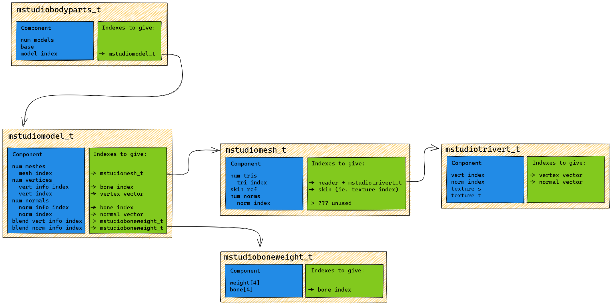
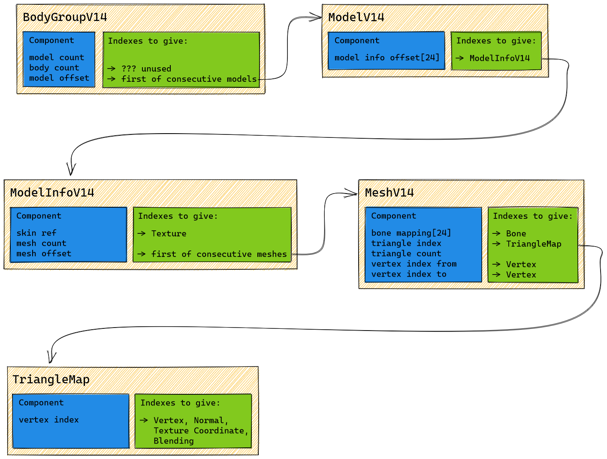

The following shows the overall, simplified topology of the MDL file format supported by the Xash3D engine. Only elements and their references are shown in this diagram, not primitive values.


## Body Groups

A "body group" for a model is a way to define some geometry variation that can be set programmatically for that model.

For example, a gun could have a `sights` body group that has the options `ironsights`, `laser_dot_sight` or `blank`. Setting a value of `0`, `1` or `2` for this body group would display different (or no) sights on the gun.

A body group is analogous to a set of radio buttons in an application, where one (and only one) option must be chosen from the set.

The Half Life MDL format allows a number of body groups, where depending on the chosen option, a different sub-model is drawn.

```
Body part (mstudiobodyparts_t) for "sights" body group
  Sub-model (mstudiomodel_t) 0: "ironsights"
  Sub-model (mstudiomodel_t) 1: "laser_dot_sight"
  Sub-model (mstudiomodel_t) 2: "blank"
```

Nightfire uses the same conceptual system, except that the internal structure of the sub-model item and its components is different.

### Combining Body Groups

If a model contains more than one body group, the number of different ways each of the body groups can be combined increases depending on how many
groups there are.

For example, if there are `2` body groups, one with `5` options and one with `3` options, there are `5 * 3 = 15` different possible permutations of options across the two groups. The number of permutations increases exponentially the more groups there are.

To select a particular combination of body group options, an entity's `body` variable is set to the index of the particular permutation. In addition, each body group entry in the MDL file itself contains a `base` value: this value is used as a divisor for the entity's `body` value, and the result is used to decide which submodel to render for this permutation.

```
subModelIndex = floor(entity.body / bodyPart.base) % bodyGroup.numSubModels
```

The `base` value can be thought of as being assigned like so:

```
for i in range [0 numBodyGroups):
  if i == 0:
    bodyGroup[i].base = 1
  else:
    bodyGroup[i].base = bodyGroup[i-1].numSubModels * bodyGroup[i-1].base
```

For any body group, the base is equal to the total number of permutations of all preceding body groups.

As an example, consider a model with `4` body groups as below:

```
Body group 0: 2 sub-models
Body group 1: 3 sub-models
Body group 2: 4 sub-models
Body group 3: 5 sub-models
```

When assigning the `base` values for these body groups, the process proceeds as follows:

```
Body group 0 (2 sub-models):
  Base: 1

Body group 1 (3 sub-models):
  Base: group 0 sub-models * group 0 base
        = 2 * 1
        = 2

Body group 2 (4 sub-models):
  Base: group 1 sub-models * group 1 base
        = 3 * 2
        = 6

Body group 3 (5 sub-models):
  Base: group 2 sub-models * group 2 base
        = 4 * 6
        = 24
```
## Submodel Topology

In a Half Life MDL, each body group and its submodels have the following structure:



In a Nightfire MDL, each body group and its submodels have the following structure:


